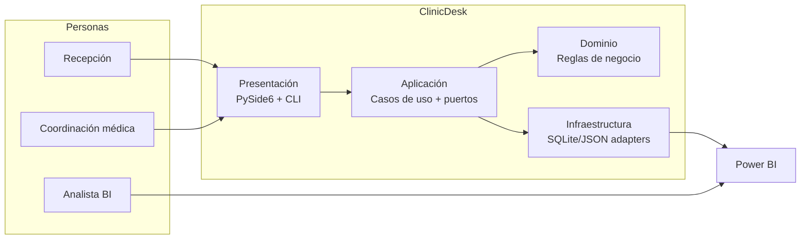

# ClinicDesk ML Architecture Case Study

[](https://github.com/<OWNER>/<REPO>/actions/workflows/quality_gate.yml)
[](https://github.com/<OWNER>/<REPO>/actions/workflows/release.yml)


Arquitectura ML reproducible para predicción de riesgo en citas clínicas, con gobernanza de artefactos y exportación contractual para Power BI.

📌 **Portfolio one-pager (recruiters):** [PORTFOLIO.md](PORTFOLIO.md)

## Qué es (en 3 bullets)
- App clínica de escritorio (PySide6) con flujo operativo + analítica de riesgo de citas.
- Pipeline ML reproducible (`seed → features → train → score → drift → export`) orientado a operación real.
- Producto "portfolio-ready": Clean Architecture, quality gate estricto y controles de seguridad/privacidad.

## Para quién
- **No técnico**: liderazgo de operación clínica que necesita priorizar citas, reducir fricción y visualizar indicadores.
- **Técnico**: equipos de ingeniería que buscan separación por capas, puertos/adaptadores y validación fuerte en CI.

## Demo rápida (3 min)
Guion recomendado para entrevista:
1. **Setup** (normal o sandbox):
   - Normal: `./scripts/setup.sh` (Linux/macOS) o `scripts\setup.bat` (Windows) o `python scripts/setup.py`.
   - Sandbox: `python scripts/setup_sandbox.py`.
2. **Arranque demo en 1 comando**: `python scripts/run_demo.py` (siembra datos demo + abre la app usando una DB demo en `./data/demo/`).
   - Si falla la demo, revisa `logs/demo_failure_summary.json` y `logs/demo_*_stderr.log`.
3. **Run demo**: dentro de la app, ejecutar pipeline completo (`seed -> build-features -> train -> score -> drift -> export`) y mostrar versiones generadas.
4. **Export/report**: abrir `exports/` y enseñar los CSV contractuales para BI (`features`, `metrics`, `scoring`, `drift`).

Guion extendido para recruiters: [docs/recruiter_kit.md](docs/recruiter_kit.md).

## Ejecutar (1 comando)
- **Camino normal**
  - Setup: `python scripts/setup.py`
  - Demo 1 comando: `python scripts/run_demo.py`
  - (Opcional) Run app sin seed: `python scripts/run_app.py`
- **Camino sandbox**
  - Setup sandbox: `python scripts/setup_sandbox.py`
  - Gate sandbox (entrypoint): `python -m scripts.gate_sandbox`

## Calidad
En CI también se ejecuta `gate_sandbox` como verificación no bloqueante.

Branch protections recomendadas: ver [docs/branch_protection_recommended.md](docs/branch_protection_recommended.md).

- Gate estricto (PR/CI):

```bash
python -m scripts.gate_pr
```

- Gate rápido (report-only, sandbox por defecto si no hay coverage):

```bash
python -m scripts.gate_rapido
```

- Gate sandbox (entornos restringidos):

```bash
python -m scripts.gate_sandbox
```

- Doctor de entorno de calidad (preflight reproducible):

```bash
python -m scripts.doctor_entorno_calidad
```

- Lint canónico de repositorio (Python + structural gate):

```bash
python -m scripts.lint_all
```

- Formato canónico de repositorio:

```bash
python -m scripts.format_all
```

- Lint canónico de Python (Ruff check + format --check):

```bash
python -m scripts.lint_py
```

- Formato canónico de Python:

```bash
python -m scripts.format_py
```

Nota: `lint_all`/`format_all` no formatean Markdown/YAML; Python sí.

`gate_pr` es el contrato estricto y canónico para CI/PR (el que usa CI).  
`gate_sandbox` mantiene señal de calidad en entornos sin todas las dependencias disponibles.

## Seguridad / Privacidad
- **PII encryption** opcional en reposo para columnas sensibles (SQLite + variables de entorno).
- **Logging guardrails** para evitar exposición de PII en auditoría y trazas.
- **Secrets scan** integrado en gate completo (gitleaks).
- **Dependency scanning** con `pip-audit` y política explícita de allowlist.

## Arquitectura (C4 mínimo)
Diagrama rápido (contexto + contenedores):



Decisiones técnicas clave:
- Clean Architecture estricta (dependencias desde presentación/infra hacia aplicación/dominio).
- Puertos/adaptadores para desacoplar casos de uso de persistencia concreta.
- Artefactos versionados con hashes para trazabilidad y reproducibilidad.

Más detalle C4 (contexto, contenedores y componentes): [docs/arquitectura_c4.md](docs/arquitectura_c4.md).

## Release bundle (atajo)
- Bundle reproducible disponible con `python -m scripts.build_release`.

## 🚀 Getting Started

### Requisitos
- Python **3.11** o superior.
- `pip` disponible en la instalación de Python.

### Setup reproducible
Desde la raíz del repo:

- **Windows (CMD/PowerShell):**

```bat
scripts\setup.bat
```

- **Linux/macOS (bash):**

```bash
./scripts/setup.sh
```

- **Alternativa multiplataforma:**

```bash
python scripts/setup.py
```

### Ejecutar la app

```bash
python scripts/run_app.py
```

### Deploy con Docker (API demo)

```bash
docker compose up --build
```

Verifica healthcheck:

```bash
curl http://localhost:8000/healthz
```


## Docker (API demo)

Esta API REST es **read-only** y pensada para portfolio. No expone PII en claro: documento/teléfono/email y nombre de paciente se devuelven redaccionados.

Levantar demo local con un comando:

```bash
docker compose up --build
```

Verificación rápida:

```bash
curl http://localhost:8000/healthz
curl -H "X-API-Key: dev_key_demo" "http://localhost:8000/api/v1/citas?desde=2026-01-01&hasta=2026-01-31&estado=PENDIENTE&texto=control"
```

Variables por defecto en `docker-compose.yml`:
- `CLINICDESK_API_KEY=dev_key_demo`
- `CLINICDESK_DB_PATH=/data/clinicdesk_demo.db`

## API demo (opcional)

También puedes arrancar sin Docker:

- Arranque API: `python -m clinicdesk.web.api.serve`
- Arranque health mínimo legacy (solo `/healthz`): `python -m clinicdesk.web.serve_health`

Configura autenticación con `X-API-Key`:

```bash
export CLINICDESK_API_KEY=mi_clave_demo
python -m clinicdesk.web.api.serve
```

Ejemplos `curl`:

```bash
curl http://localhost:8000/healthz
curl -H "X-API-Key: mi_clave_demo" "http://localhost:8000/api/v1/citas?desde=2026-01-01&hasta=2026-01-31&estado=PENDIENTE&texto=control"
curl -H "X-API-Key: mi_clave_demo" "http://localhost:8000/api/v1/pacientes?texto=ana"
```

Si `CLINICDESK_API_KEY` no está definida, la API arranca pero `/api/*` responderá `503` con mensaje de configuración.


### Evaluation Summary / Model Card ligera
El comando `export summary` genera un artefacto textual versionable para demo/CI:
- `evaluation_summary.json`: contrato estable (`schema_version=ml_eval_summary_v1`) con contexto, métricas y notas de interpretación.
- `evaluation_summary.md`: lectura rápida para entrevista (dataset, predictor, métricas test y limitaciones).

Qué mirar primero en demo técnica:
1. `context` (dataset/model/predictor y trazabilidad).
2. `metrics.test` vs `metrics.test_calibrated` para explicar calibración de threshold.
3. `interpretation` y `limitations` para comunicar alcance real y no sobre-vender resultados.
