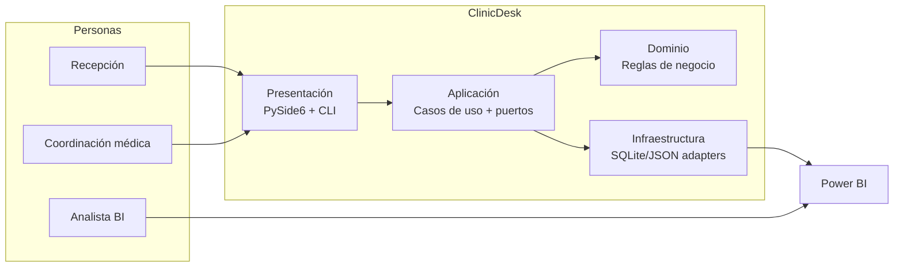

# ClinicDesk ML Architecture Case Study

[](https://github.com/<OWNER>/<REPO>/actions/workflows/quality_gate.yml)
[](https://github.com/<OWNER>/<REPO>/actions/workflows/release.yml)


Arquitectura ML reproducible para predicción de riesgo en citas clínicas, con gobernanza de artefactos y exportación contractual para Power BI.

📌 **Portfolio one-pager (recruiters):** [PORTFOLIO.md](PORTFOLIO.md)

## Qué es (en 3 bullets)
- App clínica de escritorio (PySide6) con flujo operativo + analítica de riesgo de citas.
- Pipeline ML reproducible (`seed → features → train → score → drift → export`) orientado a operación real.
- Producto "portfolio-ready": Clean Architecture, quality gate estricto y controles de seguridad/privacidad.

## Para quién
- **No técnico**: liderazgo de operación clínica que necesita priorizar citas, reducir fricción y visualizar indicadores.
- **Técnico**: equipos de ingeniería que buscan separación por capas, puertos/adaptadores y validación fuerte en CI.

## Demo rápida (3 min)
Guion recomendado para entrevista:
1. **Setup** (normal o sandbox):
   - Normal: `./scripts/setup.sh` (Linux/macOS) o `scripts\setup.bat` (Windows) o `python scripts/setup.py`.
   - Sandbox: `python scripts/setup_sandbox.py`.
2. **Seed demo**: desde la app (módulo Demo & ML) ejecutar carga de datos demo reproducibles.
3. **Run demo**: ejecutar pipeline completo (`seed -> build-features -> train -> score -> drift -> export`) y mostrar versiones generadas.
4. **Export/report**: abrir `exports/` y enseñar los CSV contractuales para BI (`features`, `metrics`, `scoring`, `drift`).

Guion extendido para recruiters: [docs/recruiter_kit.md](docs/recruiter_kit.md).

## Ejecutar (1 comando)
- **Camino normal**
  - Setup: `python scripts/setup.py`
  - Run app: `python scripts/run_app.py`
- **Camino sandbox**
  - Setup sandbox: `python scripts/setup_sandbox.py`
  - Gate sandbox (entrypoint): `python -m scripts.gate_sandbox`

## Calidad
- Gate estricto (PR/CI):

```bash
python -m scripts.gate_pr
```

- Gate rápido (report-only, sandbox por defecto si no hay coverage):

```bash
python -m scripts.gate_rapido
```

- Gate sandbox (entornos restringidos):

```bash
python -m scripts.gate_sandbox
```

`gate_pr` es el contrato estricto y canónico para CI/PR (el que usa CI).  
`gate_sandbox` mantiene señal de calidad en entornos sin todas las dependencias disponibles.

## Seguridad / Privacidad
- **PII encryption** opcional en reposo para columnas sensibles (SQLite + variables de entorno).
- **Logging guardrails** para evitar exposición de PII en auditoría y trazas.
- **Secrets scan** integrado en gate completo (gitleaks).
- **Dependency scanning** con `pip-audit` y política explícita de allowlist.

## Arquitectura (C4 mínimo)
Diagrama rápido (contexto + contenedores):



Decisiones técnicas clave:
- Clean Architecture estricta (dependencias desde presentación/infra hacia aplicación/dominio).
- Puertos/adaptadores para desacoplar casos de uso de persistencia concreta.
- Artefactos versionados con hashes para trazabilidad y reproducibilidad.

Más detalle C4 (contexto, contenedores y componentes): [docs/arquitectura_c4.md](docs/arquitectura_c4.md).

## Release bundle (atajo)
- Bundle reproducible disponible con `python -m scripts.build_release`.

## 🚀 Getting Started

### Requisitos
- Python **3.11** o superior.
- `pip` disponible en la instalación de Python.

### Setup reproducible
Desde la raíz del repo:

- **Windows (CMD/PowerShell):**

```bat
scripts\setup.bat
```

- **Linux/macOS (bash):**

```bash
./scripts/setup.sh
```

- **Alternativa multiplataforma:**

```bash
python scripts/setup.py
```

### Ejecutar la app

```bash
python scripts/run_app.py
```

### Deploy con Docker

1) Copia variables de entorno:

```bash
cp .env.example .env
```

2) Levanta base de datos + servicio web:

```bash
docker compose up --build
```

3) Verifica healthcheck:

```bash
curl http://localhost:8000/healthz
```
