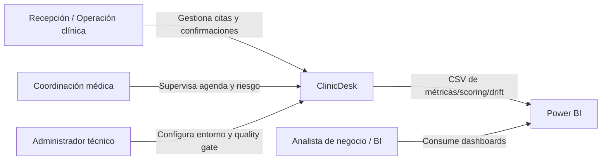
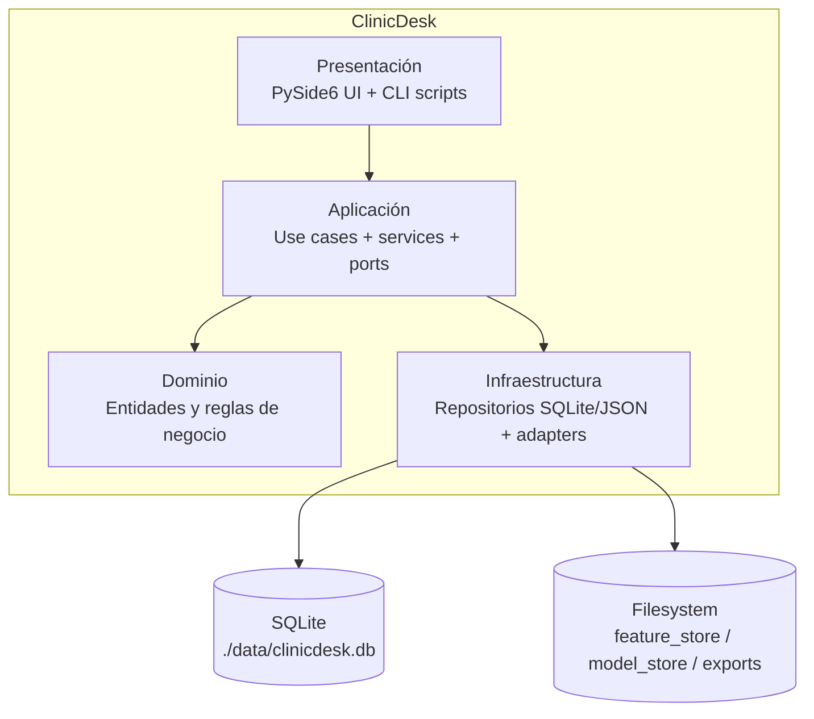
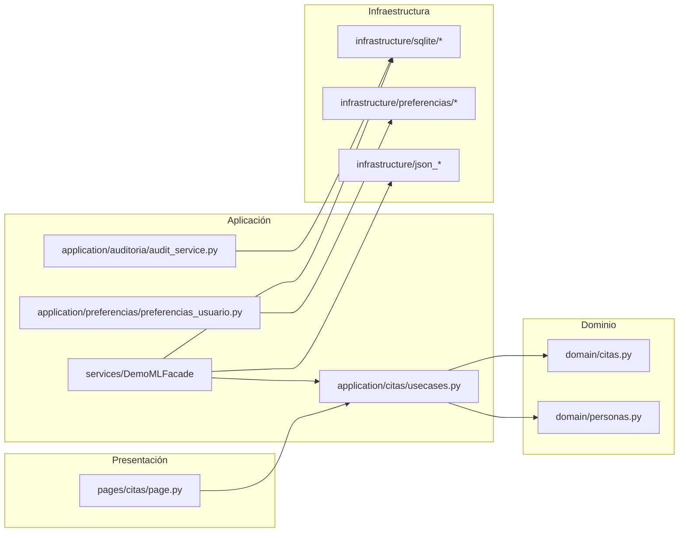

# Arquitectura C4 (ClinicDesk)

Este documento resume la arquitectura con diagramas C4 en Mermaid, usando módulos reales del repositorio.

## 1) Context Diagram

## 2) Container Diagram

## 3) Component Diagram (ejemplo acotado)

> Nota: el diagrama de componentes es intencionalmente breve y orientado a lectura rápida del producto.
